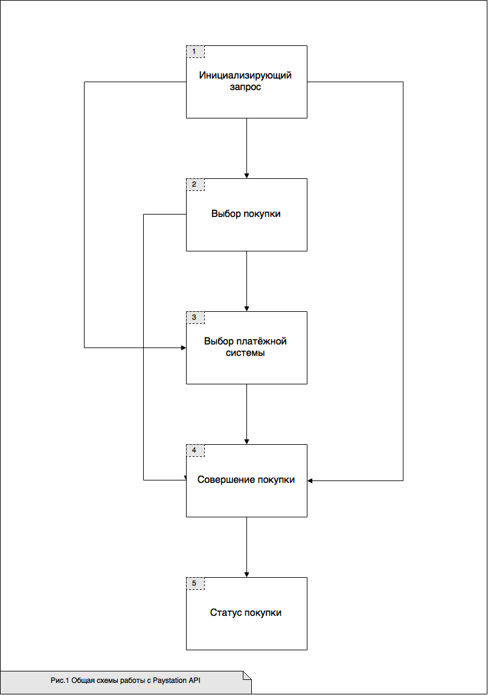
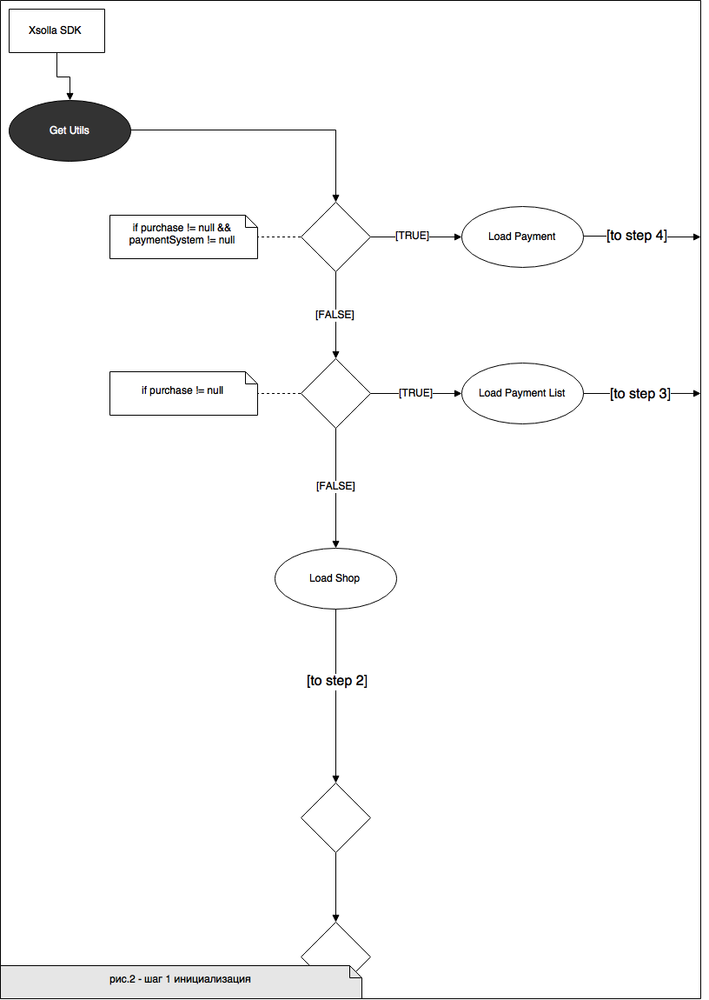
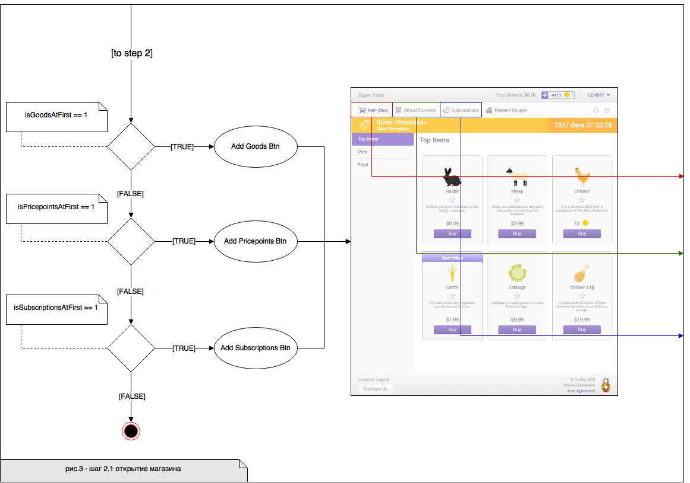
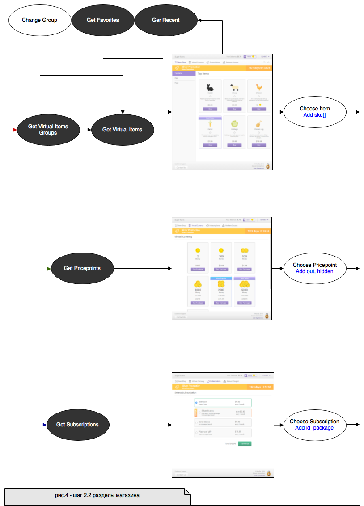
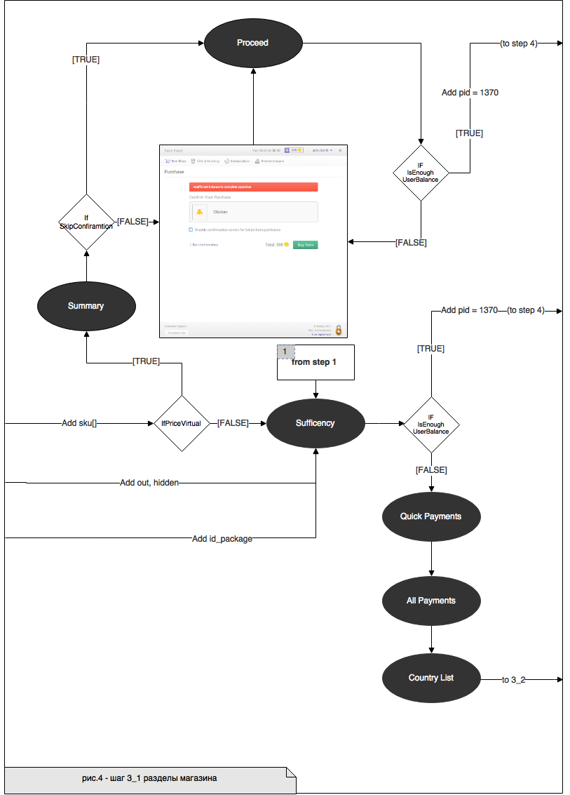

SDK - это библиотека, созданная компанией Xsolla, которая помогает реализовать функционал магазина на основе  Paystation API.

SDK была создана, чтобы: 
* упростить использование платежного решения Xsolla для разработчиков альтернативных платформ;
* снизить порог вхождения при использовании продукта на конкретной платформе.

# Оглавление 
* [Термины и сокращения](#термины-и-сокращения)
* [Цели SDK](#цели-sdk)
* [Функциональное назначение](#функциональное-назначение)
* [Взаимодействие с пользователем](#взаимодействие-с-пользователем)
* [Схема работы](#схема-работы)


# Термины и сокращения 

| Термин   |      Определение                                   |
|----------|:-------------:|
| ПО       |Программное обеспечение, подлежащее сопровождению | 
| SDK |Набор средств разработки, позволяющий специалистам по программному обеспечению создавать приложения для определённого пакета программ |
|API|Описание способов (набор классов, процедур, функций, структур или констант), которыми одна компьютерная программа может взаимодействовать с другой программой|
| Токен       |Специальная шифрованная строка, необходимая для взаимодействия с Xsolla | 
| Header |Верхняя часть окна магазина; включает в себя всё до пунктов навигационного меню включительно   |
| Footer |Нижняя часть окна магазина |
|Серверная интеграция|Интеграция и взаимодействие с Xsolla, происходящая посредством специально настроенного сервера|
| Упрощённая интеграция       |Интеграция и взаимодействие с Xsolla, при котором сервер игры отсутствует, все взаимодействия происходят через клиента | 
| JSON |Текстовый формат представления данных в нотации объекта JavaScript, предназначен для обмена данными   |
| Режим Сандбокс |Специальный режим, при котором пользователь может ознакомиться с возможностями приложения |


# Цели SDK 
Цели создания данной библиотеки:
- предоставить удобный инструмент для разработчиков, который позволит снизить трудозатраты по внедрению сервисов автоматизации решения компании Xsolla;
- улучшить качество опыта взаимодействия конечного пользователя. Инструмент:
  - становится понятным и доступным, 
  - требует меньше (или исключает) дополнительных переходов на сторонние окна.

# Функциональное назначение

Данная библиотека используется разработчиками для получения полного функционала электронного магазина (модули виртуальных валют, модули виртуальных товаров, подписоки, поддержки платёжных методов и тд.) при помощи одной функции.

Посредством взаимодействия с API реализуется создание магазина со всеми внутренними взаимодействиями, включающие в себя следующие экраны:  
- экран виртуальных товаров;
- экран виртуальной валюты;
- экран подписок;
- экраны выбора платёжных методов; 
- экран оплаты;
- экран статуса;
- экран ошибки.

# Взаимодействие с пользователем 
SDK позволяет реализовать два варианта взаимодействия пользователя с [Paystation API](https://secure.xsolla.com/paystation2/api), посредством **POST** или **GET** запросов:
1. [Серверная интеграции](#серверная-интеграции)
1. [Упрощённой интеграции](#упрощённой-интеграции)
 
### Серверная интеграции 

Авторизация пользователя происходит посредством передачи строки токена. 

### Упрощённой интеграции 

Авторизация пользователя происходит посредством передачи JSON. Она позволяет добавить возможность взаимодействия с xsolla API в сандбокс режиме. Пользователь сам может выбрать
в каком режими будет проводиться платёж. 

Для реализации упрощённой интеграции используется функция или объект  `CreateShop`, которая имеет следующий вид:
```
 CreateShop (
			string, // token or json
			bool, // is Sandbox
			OkCallback, // возможность обработать успешный платёж
			ErrorCallbck // возможность обработать платёж с ошибкой
)
```
**Описание параметров**:

| Парметр   |Вид|      Описание                                   |
|----------|------|:-------------:|
| string   ||Токен или JSON| 
| bool | |Необходим для создания режима `sandbox-`. В поле url перед secure добавить “sandbox-”.|
|OkCallback|Любой удобный формат, может не быть параметром|Успешное завершение платежа|
| ErrorCallbck | Любой удобный формат, может не быть параметром  |Неуспешное завершение платежа | 

После вызова данной функции управление процессом работы приложения со стороны разработчика-пользователя заканчивается и переходит под управление библиотеки. Контроль над работой приложения разработчик получает вновь лишь в момент успешного или неуспешного завершения платежа. 

**Пример реализации**:
```JSON
{
"user":{
"id":{
"value":0
},
"name":"",
"email":"",
"country":{
"value":"",
"allow_modify":false
}
},
"settings":{
"project_id":0,
"language":"",
"currency":"",
"mode":"sandbox",
"secretKey":""
}
}
```

Порядок запросов и переходов описан в разделе [Схема работы](#схема-работы). 

# Схема работы 
## Общая схема работы
Общая схема взаимодействия (рис. 1) с Paystation API включает в себя 5 основных шагов:
1. [Инициализирующий запрос](#инициализирующий-запрос)
1. [Выбор покупки](#выбор-покупки)
1. [Выбор платёжной системы](#выбор-платёжной-системы)
1. [Проведение платежа](#проведение-платежа)
1. [Статус покупки](#статус-покупки)

> Часть из этих шагов ([№2](#выбор-покупки), [№3](#выбор-платёжной-системы)) не являются обязательными и при необходимости могут быть пропущены. 

Вся информация, необходимая для определения схемы работы, может быть получена из шага [№1](#инициализирующий-запрос). Далее рассмотрим каждый из этих шагов в отдельности, описание будет состоять из сопровождающего текста и диаграммам, наглядно иллюстрирующих процесс работы сервиса.


 

### Инициализирующий запрос

Инициализирующим запросом в данном случае является запрос Utils. Он содержит в себе информацию о: 
* пользователе 
* проекте 
* покупаках 
* настройках 
* переводах

Если был получен корректный ответ от сервера, то в первую очередь будет просматриваться информация о покупке. С помощью этой информации определяется передана ли покупка(`purchase`). Если покупка соврешена, то необходимо проверить наличие товара в полях:
* `virtual_currency`, 
* `virtual_items`, 
* `subscription` 

и наличие платёжной системы в поле 
* `payment_system` 

Если в полученном ответе поле для товара не пустое, то шаг [№2](#выбор-покупки) пропускается (рис.1). Если в полученном ответе поле для платёжной системы не пустое, то шаг [№3](#выбор-платёжной-системы) пропускается (рис.1). Схема запроса представлена на рис. 2. 
 

 

### Выбор покупки
Выбор покупки является вторым шагом. Если в шаге [№1](#инициализирующий-запрос) не было заполнено одно из следущих полей: 

* `virtual_currency`, 
* `virtual_items`, 
* `subscription`,

то на данном шаге необходимо сконструировать магазин, в котором пользователь сможет выбрать понравившийся ему товар и реализовать свою покупку. В первую очередь будет задействована информация, полученная из шага [№1](#инициализирующий-запрос), а именно из поля объекта настроек (`settings`): 
* `goods_at_first`, 
* `pricepoints_at_first`, 
* `subscriptions_at_first`. 

Данное поле может принимать значения **0** или **1**. 
В зависимости от того, что было получено, будут формироваться следующие пункты меню соответственно (рис.3): 
- товары;
- виртуальная валюта;
- подписки.

В зависимости от полученных данных необходимо загрузить одну из категорий и отобразить её для пользователя (рис.4). Та же логика работает и при переключении пунктов меню. Далее пользователь может выбрать какой-либо из товаров и ему предоставляется два способа оплаты покупки: 
* [за реальную валюту](#покупка-за-реальную-валюту),
* [за виртуальную валюту](#покупка-за-виртуальную-валюту).
 

 
 

 
 
### Выбор платёжной системы 
 
#### Покупка за реальную валюту
В случае покупки за реальную валюту будет произведен переход к проверке пользовательского баланса. Если денежных средств на балансе пользователя достаточно, оплата продолжается через Xsolla Balance, в противном случае произойдёт открытие списка платёжных систем.
#### Покупка за виртуальную валюту
Для реализации покупки за виртуальную валюту в первую очередь выполняется запрос `Summary`, в котором будут получены содержимое покупки пользователя и метка, которая говорит о возможности пропуска подтверждение от пользователя. Если данный запрос выполнен успешно, то происходит переход к следующему запросу `Proceed`. Данный запрос определяет корректность производимой денежной операции. Если он выполняется успешно, то платёж продолжается через Xsolla Balance, в противном случае он выдаст ошибку. Если была получена ошибка или необходимо подтверждение от пользователя, то мы попадаем на экран подтверждения платежа, на котором пользователю показана его покупка, чекбокс с надписью: “Спрашивать ли подтверждение в следующий раз” и сама ошибка, если был совершен переход после запроса `Proceed`. Подробную схему реализации покупок можно увидеть на рис. 5.
 

 


 
